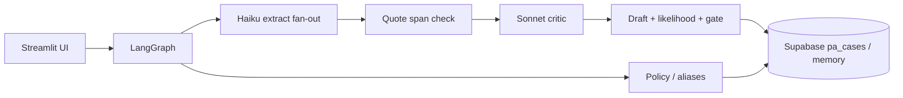

# FieldCheck Prior Authorization

LangGraph agent that takes drug + diagnosis + payer + clinical note, decides if prior authorization is required, drafts a paste-ready PA form, self-checks extraction, scores approval likelihood, and escalates **fields** — not whole cases.

**Demo data — not real PHI.** Synthetic notes only. Never paste real patient text (notes may go to OpenRouter).

---

## Quick start

```bash
# 1. Python env
python3.13 -m venv .venv          # 3.12+ also fine
source .venv/bin/activate
pip install -r requirements.txt

# 2. Env file
cp .env.example .env
# Edit .env — at minimum set OPENROUTER_API_KEY (see Demo reproduction below)

# 3. Optional Supabase (persistence); skip to use in-memory seeds only
#    Paste sql/setup.sql in Supabase SQL Editor, then:
python scripts/ping_supabase.py

# 4. Smoke + UI
python scripts/ping_openrouter.py
.venv/bin/streamlit run app.py
# → http://localhost:8501
```

Offline tests (no API spend):

```bash
pytest -q
```

---

## Tech stack & architecture

| Layer | Tech |
| ----- | ---- |
| UI | Streamlit (`app.py`) |
| Orchestration | LangGraph 10-node graph (`src/pa_agent/graph/`) |
| LLMs | OpenRouter only — Claude Haiku (extract), Claude Sonnet (critic); no Anthropic SDK |
| Data | In-memory seed store + optional Supabase (`sql/`) |
| Config | `.env` / `python-dotenv` |

### Simple architecture



**Interactive diagram:** [docs/archify/pa-intake-architecture.html](docs/archify/pa-intake-architecture.html)

```bash
open docs/archify/pa-intake-architecture.html   # macOS
```

| Pipeline stage | Role |
| -------------- | ---- |
| Intake → coverage | Alias normalize; policy lookup; early exit if no PA / unknown policy |
| Extract → quote verify | Parallel Haiku; **deterministic** substring check zeros invented quotes |
| Critic → draft → score | One Sonnet batch; verified-quotes-only justification; math likelihood |
| Alternative → gate → finalize | Formulary alt if likelihood &lt; 0.55; escalate unmet field IDs; upsert + markdown export |

Machine-readable diagram source: [docs/archify/pa-intake.architecture.json](docs/archify/pa-intake.architecture.json).

---

## How to reproduce the demo

### 1. Environment variables & sample `.env`

Copy the template and fill secrets:

```bash
cp .env.example .env
```

Minimal **live demo** `.env`:

```bash
# Required for live LLM calls
OPENROUTER_API_KEY=sk-or-v1-your-key-here

# 0 = live OpenRouter; 1 = offline mocks (pytest forces mock)
USE_MOCK_EXTRACT=0

# Keep off unless rehearsing talk-track #2 (hallucinated quote)
INJECT_FIXTURE_C_HALLUCINATION=0

# Optional — case persistence + live reference tables
SUPABASE_URL=https://your-project.supabase.co
SUPABASE_SERVICE_ROLE_KEY=your-service-role-key

OPENROUTER_HTTP_REFERER=http://localhost:8501
OPENROUTER_APP_TITLE=FieldCheck-Prior-Authorization
```

Full commented template: [`.env.example`](.env.example).

| Variable | Required? | Purpose |
| -------- | --------- | ------- |
| `OPENROUTER_API_KEY` | Yes for live | OpenRouter key ([openrouter.ai](https://openrouter.ai)) — Cursor credits do **not** pay these calls |
| `USE_MOCK_EXTRACT` | No (default mock-on in code if unset carefully) | `0` live / `1` mock |
| `SUPABASE_URL` + `SUPABASE_SERVICE_ROLE_KEY` | No | Persistence; omit → in-memory seeds |
| `INJECT_FIXTURE_C_HALLUCINATION` | No | Demo-only fake c3 quote in live mode |
| `LATENCY_LOG` | No | Per-node timings |

**Keys:** get OpenRouter from the OpenRouter dashboard. Supabase **service role / secret** from Project Settings → API Keys (not the publishable/anon key).

### 2. Demo run (UI — recommended)

```bash
source .venv/bin/activate
.venv/bin/streamlit run app.py
```

In the sidebar, load fixtures in order **Needs review → No PA → Auto completed** (C → A → B), then **Run FieldCheck** each time.

### 3. Demo run (CLI talk track)

```bash
python scripts/demo.py --talk    # C → A → B + 90s talking points
python scripts/breakit.py        # empty note / unknown drug — safe escalate
python scripts/live_smoke.py     # ping + Fixture B live graph
```

### 4. 90-second talk track

1. Escalate **fields**, not cases — Fixture C checklist  
2. Model cannot invent evidence — failed quote → confidence 0 **in code**  
3. Second model critiques, then **math** scores approval  
4. Likely deny → same-class **no-PA** alternative  
5. Paste the markdown. Stop talking.

---

## Datasets / synthetic data & provenance

All clinical content is **synthetic**, authored for this hackathon. **No real PHI, no patient records, no scraped EHR data.**

| Asset | Location | Provenance |
| ----- | -------- | ---------- |
| Golden fixtures A/B/C | [`fixtures/`](fixtures/) | Hand-written JSON: intake fields, clinical notes, expected status, mock extract/critic maps. Spec: `PA-Intake-hackathon-spec-v2.md` §9 |
| Payer / drug aliases | [`sql/seed.sql`](sql/seed.sql), [`src/pa_agent/data/seed_store.py`](src/pa_agent/data/seed_store.py) | Synthetic alias maps (e.g. UHC→UnitedHealthcare, Humira→adalimumab) |
| Payer policies (8 rows) | same | Invented PA criteria + weights for demo drugs/diagnoses (UHC adalimumab RA, Aetna semaglutide, etc.) |
| Formulary alternatives | same | Synthetic same-class swaps (e.g. adalimumab → etanercept, no PA) |
| Schema | [`sql/schema.sql`](sql/schema.sql) / [`sql/setup.sql`](sql/setup.sql) | Hackathon Postgres/Supabase DDL |

| Fixture | Expected outcome |
| ------- | ---------------- |
| `fixture_a_no_pa.json` | `no_pa_required` |
| `fixture_b_auto_completed.json` | `auto_completed`, likelihood ≥ 0.75 |
| `fixture_c_needs_review.json` | `needs_review`, missing c3/c4, alternative etanercept |

UI banner and exports state: **Demo data — not real PHI.**

---

## Known limitations & next steps

### Known limitations

- **Synthetic-only** — not validated on real payer policies or charts; do not use in production clinical workflows.
- **OpenRouter dependency** — live path needs network + spend; provider routing can vary for the same Claude slug.
- **Small policy set** — ~8 seeded policies / few payers; unknown drug/payer correctly escalates but is not a full formulary engine.
- **No auth / RLS theater** — Streamlit + service-role Supabase is demo-grade, not multi-tenant secure.
- **Qty/duration LLM off by default** — draft narrative is verified-quotes-only; optional Sonnet meta via `USE_DRAFT_META_LLM=1`.
- **Latency** — live Haiku fan-out + Sonnet critic still dominate wall clock (mitigated with caches and critic short-circuits).
- **Quote check is substring-based** — strong against invention, weaker on paraphrase/OCR noise.

### Next steps

- Expand policy/formulary coverage and payer-specific templates.
- Human-in-the-loop audit log and role-based access (replace service-role-in-UI pattern).
- Stronger quote grounding (fuzzy/span alignment) while keeping fail-closed invent checks.
- Eval harness on held-out synthetic + de-identified notes; calibration of likelihood blend.
- Deploy Streamlit/API behind proper secrets management; RLS on `pa_cases`.
- Optional: batch extract mode / cheaper critic for latency SLAs.

---

## Extra reference

```bash
pytest -q                          # all blocks, mocked LLMs
python scripts/run_golden.py       # golden A/B/C statuses
python scripts/ping_supabase.py    # DB health
```

Build status: Blocks 1–8 complete per `PA-Intake-hackathon-spec-v2.md`.
